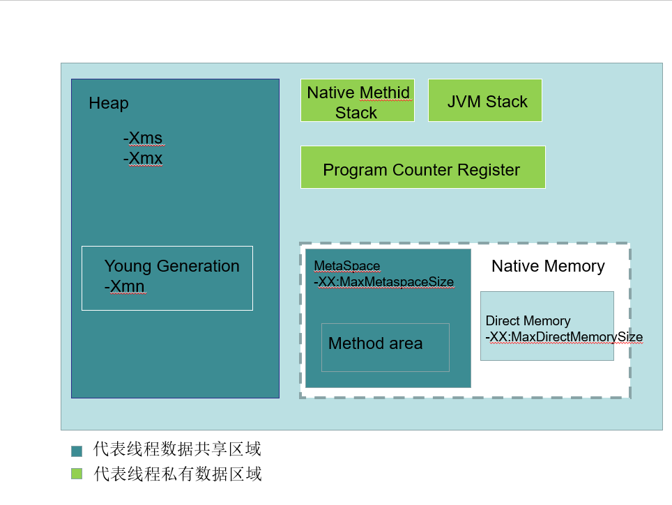

画图展示Xmx, Xms, Xmn, Metaspace, DirectMemory,Xss这些内存参数的关系

-Xms堆内存空间的初始大小，是指设定程序启动时占用内存大小。一般来讲，大点，程序会启动的快一点，但是也可能会导致机器暂时变慢。
-Xmx最大堆内存，是指设定程序运行期间最大可占用的内存大小。如果程序运行需要占用更多的内存，超出了这个设置值，就会抛出OutOfMemoryException。
-Xss每个线程栈的字节数，是指设定每个线程的堆栈大小。需要根据自己的程序，计算一个线程大约需要占用多少内存，可能会有多少线程同时运行等。
-Xmn新生代大小，是指堆内新生代的大小，
-XX:MaxDirectMemorySize 系统可使用的最大堆外内存(直接内存)
-XX:MaxMetaSpaceSize 元数据空间